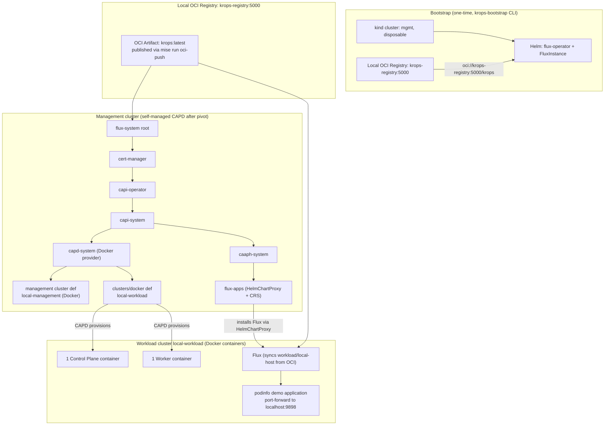

# Architecture

GitOps-driven [Cluster API](https://cluster-api.sigs.k8s.io/) (CAPI) management
platform. A disposable local [kind](https://kind.sigs.k8s.io/) cluster
bootstraps [Flux](https://fluxcd.io/), provisions the self-managed management
cluster through CAPI, and is deleted after a `clusterctl move` pivot. The
management cluster then reconciles itself and all downstream infrastructure from
this repository across two supported environments: AWS (`aws`) and
local Docker (`local-host`).

The operator normally runs the imperative lifecycle through the
`krops-toolbox` container. It mounts the host engine socket, joins the kind
network while the bootstrap cluster exists, and leaves no toolbox workload in
the managed clusters. This packaging changes the host tool boundary, not the
Flux or CAPI reconciliation architecture.

## AWS environment (aws)

The reference environment manages AWS infrastructure through the Kubernetes
API: CAPA provisions the EKS management cluster and the TrueHear workload
clusters, CAPI addons deliver per-cluster Flux instances, and ACK operators
(IAM, EKS) on the management cluster create the per-environment Pod Identity
roles, policies, and associations with static SOPS credentials. There are no
S3 buckets or RDS instances in the account. Workload clusters run no
controllers and hold no credentials.


```mermaid
flowchart TD
    subgraph bootstrap["Bootstrap (one-time, krops-bootstrap CLI)"]
        KIND[kind cluster: mgmt, disposable]
        HELM[Helm: flux-operator + FluxInstance]
        SEC[Secrets: flux-github-pat + sops-age]
        KIND --> HELM
        KIND --> SEC
    end

    subgraph git["Git: github.com/TrueHear-Infra/truehear-infra-dev"]
        REPO[(main branch)]
    end

    HELM -->|"sync: mgmt/aws/"| REPO

    subgraph mgmt["Management cluster (self-managed after the pivot) - Flux Kustomizations (dependsOn order)"]
        FS[flux-system root]
        CM[cert-manager]
        CO[capi-operator]
        CI[capa-identity]
        AMC[aws-managed-clusters]
        MGMT[management cluster def<br/>self-hosted via the pivot]
        CAPIS[capi-system]
        CAPAS["capa-system (SOPS creds)"]
        CAAPH[caaph-system]
        ACKC["ack-controllers (SOPS creds)<br/>ACK IAM + EKS controllers"]
        STGPI["staging-pod-identity<br/>truehear-staging-* roles + associations"]
        AWSIAM["aws-global-iam<br/>krops-reader console user"]
        KONF["konflate (SOPS token)<br/>rendered Flux PR review"]
        EUN[eu-north-1 cluster defs<br/>management + staging]
        FA["flux-apps (SOPS pull secret)<br/>HelmChartProxy + per-env ClusterResourceSets"]

        FS --> CM --> CO
        CO --> CI --> AMC
        CO --> CAPIS --> CAPAS --> CAAPH --> FA
        CAPAS --> EUN
        CAPAS --> MGMT
        FS --> ACKC --> STGPI
        ACKC --> AWSIAM
        FS --> KONF
    end

    REPO --> FS

    subgraph aws["AWS: eu-north-1"]
        EKS0[EKS: eu-north-1-management<br/>2 x t4g.medium (self-managed)]
        EKS2[EKS: eu-north-1-staging<br/>3 x t3.medium, one VPC]
        SROLES[IAM Roles: truehear-staging-*<br/>trust: pods.eks.amazonaws.com (Pod Identity)]
        RUSER[IAM User: krops-reader<br/>console login, assumes truehear-* roles]
    end

    EUN -->|CAPA provisions| EKS0
    EUN -->|CAPA provisions| EKS2
    AWSIAM -->|creates| RUSER
    RUSER -.->|sts:AssumeRole| SROLES
    STGPI -->|ACK creates on the mgmt cluster| SROLES

    FA -->|"HelmChartProxy: flux-operator<br/>CRS: FluxInstance + cluster-vars + pull secret"| WF2


    subgraph wl2["Workload cluster eu-north-1-staging"]
        WF2["Flux (sync: workload/eu-north-1-staging)<br/>platform + environments/staging overlay"]
    end

    WF2 --> REPO
```

### Reconciliation order (AWS management cluster)

Enforced with Flux `dependsOn`:

```
cert-manager ▶ capi-operator ▶ capi-system ▶ capa-system ▶ clusters (eu-north-1)
                            │                            └▶ caaph-system ▶ flux-apps
                            └▶ capa-identity ▶ aws-managed-clusters
ack-controllers ▶ staging-pod-identity
ack-controllers ▶ aws-global-iam
konflate (no dependencies)
```

The `eu-north-1` cluster definitions include the management cluster itself
(`clusters/management/`): after the pivot, the management cluster's own Flux
instance reconciles the Cluster objects that define it. The bootstrap kind
cluster no longer exists at this point; nothing runs from an operator's
laptop.

### PR review: konflate

The management cluster also runs a single
[konflate](https://github.com/home-operations/konflate) instance
(`mgmt/aws/infrastructure/konflate/`), pointed at this repo
(`github://TrueHear-Infra/truehear-infra-dev`, rendering from the repo root). It renders each
open PR at its merge-base and head and shows the diff of the *rendered* Flux
output (blast radius, image changes, render failures, and danger lint)
instead of the raw file diff. Results reach the PR two ways: a GitHub Actions
workflow (`.github/workflows/konflate.yml`) runs a one-shot konflate service
container on each PR push and gates the `konflate / Rendered Flux diff` check
on a clean render, and the in-cluster instance posts the rendered summary
comment and a `Konflate` commit status itself (write-back, outbound-only, so
the local kind cluster needs no inbound reachability from GitHub). Both upsert
the same marker-keyed comment. Full details (deployment, CI gate, tokens,
write-back, UI access): [PR review: konflate](./konflate.md).

### Reconciliation order (AWS workload clusters)

```
platform (StorageClass, ALB controller) > truehear-platform (namespaces,
ServiceAccounts, backend) > keycloak, vault, redis, rabbitmq (each dependsOn
truehear-platform; vault, redis, rabbitmq are HelmReleases, keycloak is a
plain manifest overlay). Environment-neutral service roots and charts come
from workload/base, composed through the environment overlay
(workload/environments/<env>), never directly. The sync root
workload/eu-north-1-staging declares the six Flux Kustomizations.
```

### How workload apps are delivered (AWS)

1. Each `Cluster` in `mgmt/aws/clusters/` carries the labels `fluxcd:
   enabled`, `region: <region>`, and `environment: <env>` (the TrueHear
   cluster, `eu-north-1-staging`).
2. `flux-apps` matches those labels: a **HelmChartProxy** installs the Flux
   Operator on every workload cluster, and per-environment
   **ClusterResourceSets** apply a `FluxInstance` (syncing
   `workload/eu-north-1-<env>/`), a `cluster-vars` ConfigMap (the
   `postBuild` substitution channel: region, cluster name, EKS name, account
   ID, environment, VPC ID, Keycloak hostname and ACM certificate ARN), and
   the Git pull secret. See
   [TrueHear environments](./truehear-environments.md) for the matrix.
3. The workload cluster's Flux reconciles its sync root, whose Flux
   Kustomizations point at `workload/platform` and the environment overlay
   (which composes `workload/base`). The `eu-north-1-staging` sync root
   exists and reconciles the full stack. Adding an app to the layering is documented
   in [Extending](./extending.md).

See [AWS authentication & IAM](./aws-iam.md) for how the ACK controllers
authenticate and what the per-environment Pod Identity roles create.

## Local host environment (local-host)

The `local-host` environment replaces AWS with local Docker containers (CAPD)
and GitHub with a local in-memory OCI registry (`krops-registry:5000`). It
provisions a one-control-plane/one-worker workload cluster and reconciles the
Podinfo demo application end to end on a single host.

See the architecture diagram in [docs/local-host-infra.svg](local-host-infra.svg).




### Reconciliation order (local-host)

Management cluster:
```
cert-manager ▶ capi-operator ▶ capi-system ▶ capd-system ▶ clusters (local-management, local-workload)
                            │                            └▶ caaph-system ▶ cni ▶ flux-apps
```

Workload cluster:
```
podinfo (HelmRelease reconciled by local workload Flux from OCI artifact)
```
