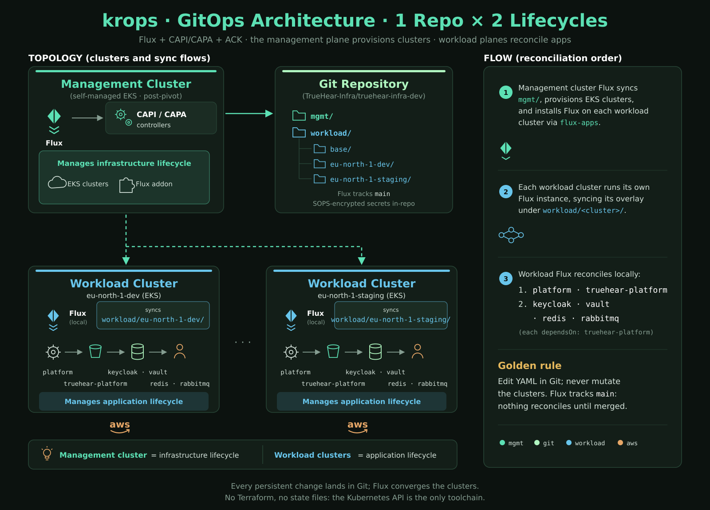

# AWS environment

The `aws` environment is the reference: a disposable kind bootstrap cluster
runs Flux, CAPA v2.13.0 provisions self-managed EKS clusters, the pivot moves
the management objects into the `eu-north-1-management` cluster, and each EKS
workload cluster runs its own ACK operators (S3, RDS, IAM) reconciling AWS
resources from `workload/base/`.



## Clusters

| Region | Clusters |
|---|---|
| `eu-north-1` | `eu-north-1-management` (the self-managed management cluster, provisioned by the pivot) and `eu-north-1-workload` |
| `eu-west-1` | `eu-west-1-workload` |

Every cluster is an EKS control plane with the `eks-pod-identity-agent` addon
and an x86 plus an ARM (Graviton2) `AWSManagedMachinePool` at the cheapest
offered 2 vCPU / 4 GiB shape for the region. The management cluster lives in
`eu-north-1` and, after the pivot, reconciles its own Cluster objects.

## Prerequisites

- An AWS account where you hold permission to create EKS clusters, VPCs, and
  IAM roles. The ACK controllers need the `iam:CreateRole`/`PutRolePolicy`/
  `GetRole`/`TagRole` and `iam:CreateUser`/`PutUserPolicy`/`GetUser`/
  `GetUserPolicy`/`TagUser` actions (for the `krops-reader` console user), and
  `eks:CreatePodIdentityAssociation`/`DescribePodIdentityAssociation`/
  `DeletePodIdentityAssociation`. RDS management is granted through the
  Git-declared `krops-ack-rds-controller` pod-identity role, not static
  credentials.
- `mise -E aws install` (adds `aws-cli` and `clusterawsadm`), a GitHub PAT and
  an age key as for any GitHub-synced environment (`.env`, see
  [operations.md](./operations.md)).
- The `clusterawsadm` IAM CloudFormation stack, provisioned once before
  bootstrap and removed by a full AWS teardown:

  ```sh
  mise -E aws run aws-bootstrap
  # == clusterawsadm bootstrap iam create-cloudformation-stack --region eu-north-1
  ```

- AWS service quotas for a clean account. The default run creates two EKS
  clusters in `eu-north-1` and one in `eu-west-1`, each with a NAT gateway per
  AZ (one EIP each), so it needs at least 6 free EIPs in `eu-north-1` and 3 in
  `eu-west-1`. The default regional limit is 5, so request the increase before
  the first run (see [Operations](./operations.md#aws-service-quotas-common-first-run-blockers)).

## Credentials

There are two credential surfaces, and neither is a static key on a workload
cluster.

- **CAPA (management cluster).** The EKS control planes and node pools are
  provisioned by CAPA from a single SOPS-encrypted profile in Git at
  `mgmt/aws/capi-providers/capa-system/aws-credentials.sops.yaml` (the
  `configSecret` on the `aws` infrastructure provider). To set or rotate it:

  ```sh
  mise -E aws run aws-bootstrap                                  # 1. CloudFormation stack
  mise run aws-credentials                                       # 2. clusterawsadm bootstrap credentials encode-as-profile
  # 3. paste the printed profile into
  #    mgmt/aws/capi-providers/capa-system/aws-credentials.sops.yaml
  #    as AWS_B64ENCODED_CREDENTIALS
  mise run sops-encrypt mgmt/aws/capi-providers/capa-system/aws-credentials.sops.yaml
  ```

- **ACK controllers (workload clusters).** No credentials at rest. Each EKS
  control plane enables the `eks-pod-identity-agent` addon, and the management
  cluster's ACK IAM + EKS controllers create one IAM `Role` per controller
  (trusted by `pods.eks.amazonaws.com`) plus a `PodIdentityAssociation` per
  cluster and controller that binds the controller ServiceAccounts to their
  roles. See [AWS authentication & IAM](./aws-iam.md) for the full chain.

## Commit the identifiers

1. `mgmt/aws/addons/flux-apps/flux-instance.yaml` (the `cluster-vars`
   ConfigMap per region): set `AWS_ACCOUNT_ID` to your account ID. It is used
   by Flux `postBuild` substitution for the S3 bucket names.
2. The EKS version is pinned in each `cluster.yaml`
   (`mgmt/aws/clusters/<region>/<env>/`); bump it deliberately, not with a
   generic dependency update.

## Bootstrap, pivot, teardown

```sh
mise run bootstrap                 # aws: kind + Flux + CAPA; then pivot into eu-north-1-management
mise run mgmt-kubeconfig           # ~/.kube/krops-mgmt.yaml
mise -E aws run kubeconfigs        # workload kubeconfigs (aws eks update-kubeconfig per region)
```

Bootstrap ends with the pivot: the CAPI inventory moves from the disposable
`mgmt` kind cluster into the self-managed `eu-north-1-management` EKS cluster
and the kind cluster is deleted (see [Pivot recovery](./operations.md#pivot-recovery)).

Teardown is automated for `aws`. `mise run teardown` suspends Flux, deletes
every workload CAPI Cluster, runs a best-effort AWS sweep for both workload
regions and the self-managed management cluster (pod identity associations,
nodegroups, EKS control planes, orphaned RDS, CAPA-tagged VPC resources,
versioned S3 buckets, CAPA and ACK IAM roles, the `krops-reader` user, and the
`clusterawsadm` CloudFormation stack), and removes the kind bootstrap cluster.
See [Teardown](./operations.md#teardown) for the controls.

## Reconciliation order

Management cluster (`mgmt/aws/`):

```
cert-manager > capi-operator > capi-system > capa-system > clusters (eu-north-1, eu-west-1)
                                     + caaph-system > flux-apps
ack-controllers > ack-pod-identity
ack-controllers > aws-global-iam
konflate (no dependencies)
```

Workload clusters (`workload/<region>-01/`):

```
aws-operators (ACK S3 + RDS + IAM controllers) > s3-buckets (Bucket CRs)
                                               + rds-instances (DBInstance CRs)
                                               + iam-roles (Role CRs)
```

## Upgrading CAPA

CAPA minors: merge one at a time and let the management cluster settle before
the next. EKS cluster versions are not Renovate-managed and upgrade
independently of the provider (see
[Dependencies](./dependencies.md)).

## Known limitations

- The ACK RDS `DBInstance` sets no `dbSubnetGroupName`, so the instance lands
  in the region's **default VPC**, not the EKS VPC (CAPA creates the EKS VPC
  dynamically). See [Workload resources](./workload-resources.md).
- No GPU node pools: they would need a GPU instance type and quota, and the
  default run is the cheapest offered ARM and x86 shapes only.
